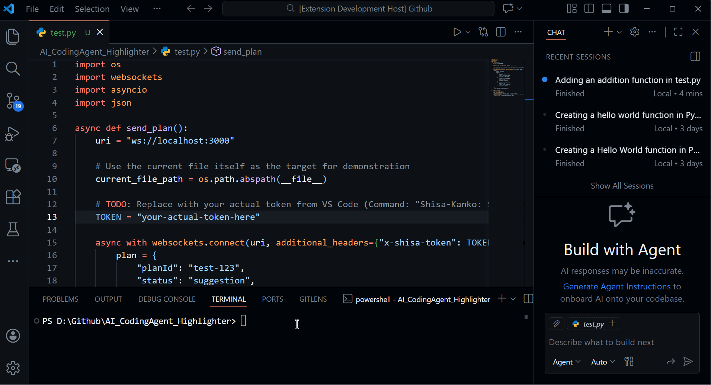

# Shisa-Kanko (Code Observer HUD)


[](https://marketplace.visualstudio.com/items?itemName=spec-tre.shisa-kanko)
[](https://github.com/pjy010218/AI_CodingAgent_Highlighter/blob/main/LICENSE)



**Shisa-Kanko** is a "Universal HUD for AI Agents". It is a pure visualization tool that highlights code changes proposed by AI agents, inspired by the Japanese safety practice of *pointing and calling*.

Unlike other AI extensions, **Shisa-Kanko is NOT an AI model**. It is an observer that visualizes the intentions of *other* agents (internal or external) in real-time.

## Features

### 1. Universal HUD (Observer Role)
- **Heads-Up Display**: Instantly see which files and lines an AI is about to change.
- **WebSocket Protocol**: Any agent (Python, Node.js, CLI apps) can connect to Shisa-Kanko via port 3000 to send modification plans.
- **Passive Integration**: Shisa-Kanko does not tamper with your AI chat workflows; it only visualizes the results.

### 2. Semantic Highlighting
Categorize AI changes with distinct colors:

| Type | Color | Meaning |
| :--- | :--- | :--- |
| **`logic_change`** | 🔵 **Blue** | Functional changes, bug fixes, logic updates. |
| **`refactor`** | 🟢 **Green** | Code optimization, cleanup, refactoring. |
| **`suggestion`** | 🟡 **Yellow** | General ideas, comments, or UI suggestions. |

### 3. Explorer Indicators
Modified files are marked in the File Explorer:
- **Badge**: `AI` (next to filename)
- **Color**: Distinctive light blue text (`#c7ddff`)

## Security & Authentication

To prevent unauthorized access, Shisa-Kanko uses a token-based authentication system.

1. **Get the Token**: runs the command `Shisa-Kanko: Show Connection Token` in VS Code.
2. **Connect**: When your external agent connects to the WebSocket (default port 3000), it MUST include the `x-shisa-token` header with this token value.

```javascript
const WebSocket = require('ws');
const ws = new WebSocket('ws://localhost:3000', {
    headers: {
        'x-shisa-token': 'YOUR_SECURE_TOKEN_HERE'
    }
});
```

## Configuration

| Setting | Default | Description |
| :--- | :--- | :--- |
| `shisa-kanko.port` | `3000` | The port number for the WebSocket server. |
| `shisa-kanko.observerMode` | `selective` | Controls autonomous observation: `selective` (ignore manual typing), `force` (always on), or `none` (WebSocket only). |
| `shisa-kanko.hudStyle` | `high-visibility` | Choose visual style: `high-visibility`, `minimalist` (gutter), or `underline`. |


## JSON Protocol

To highlight changes, simply send a JSON object to Shisa-Kanko's WebSocket server:

```json
{
  "planId": "unique-id",
  "status": "suggestion",
  "targets": [
    {
      "filePath": "/absolute/path/to/file.py",
      "lines": [10, 11, 12],
      "changeType": "logic_change", 
      "reason": "Optimize the loop."
    }
  ]
}
```

## Quick Start Example

Want to test it immediately? Copy this python snippet (requires `pip install websockets`):

```python
import asyncio, websockets, json, os

async def hello():
    # Replace with your token from VS Code command: "Shisa-Kanko: Show Connection Token"
    token = "YOUR_TOKEN"
    uri = "ws://localhost:3000"
    async with websockets.connect(uri, additional_headers={"x-shisa-token": token}) as ws:
        await ws.send(json.dumps({
            "planId": "test-1", "status": "suggestion",
            "targets": [{ "filePath": os.path.abspath(__file__), "lines": [1], "changeType": "refactor", "reason": "Hello Shisa!" }]
        }))
        print("Sent!")

asyncio.run(hello())
```


1. **Install**: `npm install`
2. **Launch**: Press `F5` in VS Code to start the extension.
3. **Observe**: Once active, it will listen on port 3000 for any incoming plans.